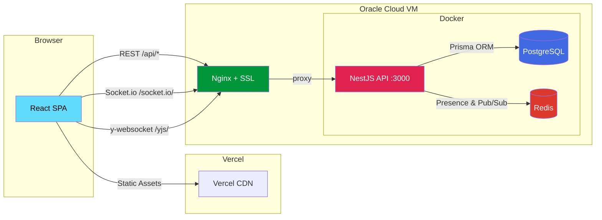

# FlowBoard

Real-time collaborative Kanban board with live presence, CRDT editing, and demo bots.

**[> View Live Demo](https://YOUR_DEPLOYED_URL/demo)** — See 3 AI bots collaborating in real-time. No sign-up required.


## What is FlowBoard?

A real-time collaborative Kanban board demonstrating dual WebSocket architecture (Socket.io + Yjs), CRDT-based collaborative editing, presence systems, and complex drag-and-drop interactions. Features a demo mode with 3 simulated bot collaborators that showcase all collaboration features without requiring a second user.

## Why I Built This

Real-time collaboration is the hardest problem in web development. I built FlowBoard to demonstrate mastery of the entire stack — presence systems, conflict-free editing, optimistic sync, and complex frontend interactions — in a single project that a recruiter can experience in 30 seconds without signing up.

The biggest technical challenge was running two WebSocket servers on the same HTTP server without conflicts. Socket.io handles board-level sync — card moves, list changes, CRUD broadcasts, and presence heartbeats — all scoped to per-board rooms. A separate y-websocket server handles CRDT document sync for collaborative card editing via TipTap + Yjs. They coexist through path-based WebSocket upgrade routing: Socket.io claims `/socket.io/` while y-websocket claims `/yjs/`, with a custom upgrade dispatcher in `main.ts` that inspects the request URL before forwarding.

The demo mode was its own engineering puzzle. Three server-side bots (Maria, Carlos, Ana) follow a scripted 60-second choreography — one drags cards, another types in an editor character by character, the third adds labels and moves cards to Done. After the intro, they switch to weighted random behavior. The trick: bots call service methods directly instead of connecting via WebSocket, so they're indistinguishable from real users without counting against connection limits. Their cursors, avatars, and edits flow through the exact same presence and collaboration systems as real users.

Every technical decision was deliberate. Yjs CRDTs for conflict-free editing (no last-write-wins on descriptions). FLOAT fractional indexing for card ordering with rebalancing after dense insertions. Optimistic updates with 5-second timeout and rollback animation for instant drag feedback. Redis-backed presence with heartbeat-based tracking for production-grade architecture. A monorepo with shared types to demonstrate full-stack TypeScript from database to UI.

## Architecture



The backend runs a single NestJS HTTP server with three distinct communication paths:

- **Socket.io** (`/socket.io/`) — Board-level sync: card moves, list changes, CRUD broadcasts, and presence heartbeats. Uses rooms for per-board isolation so events only reach clients viewing the same board.
- **y-websocket** (`/yjs/`) — Document-level CRDT sync: collaborative card description editing via TipTap + Yjs. Persists Y.Doc state to a PostgreSQL BYTEA column on last-user disconnect and on a 30-second debounce timer during active editing.
- **Redis** — Presence state (who's online, cursor positions) via heartbeat-based tracking with automatic expiry. Also serves as the Socket.io adapter for horizontal scaling readiness.

## Tech Stack

| Technology | Purpose |
|------------|---------|
| React 19 + Vite 8 | SPA with fast HMR, concurrent features |
| NestJS 11 | API server with WebSocket gateway, DI, guards |
| PostgreSQL 16 + Prisma 7 | Typed ORM with BYTEA for Yjs document persistence |
| Redis 7 | Presence heartbeats, cursor state, pub/sub |
| Socket.io 4.8 | Board-level sync: card moves, CRUD broadcasts, presence |
| Yjs 13.6 + y-websocket 3 | CRDT collaborative editing via TipTap |
| @dnd-kit/react 0.3 | Drag-and-drop with cross-list sorting |
| motion (Framer Motion) 12 | Layout animations, spring physics, exit transitions |
| TailwindCSS 4 | Utility-first dark theme styling |
| Turborepo + pnpm | Monorepo build orchestration |

## Getting Started

### Prerequisites

- Node.js 22+
- pnpm 10+
- Docker (for PostgreSQL + Redis)

### Setup

1. Clone the repo
   ```bash
   git clone https://github.com/YOUR_USERNAME/flowboard.git
   cd flowboard
   ```

2. Install dependencies
   ```bash
   pnpm install
   ```

3. Start PostgreSQL + Redis
   ```bash
   docker compose up -d
   ```

4. Configure environment
   ```bash
   cp .env.example apps/api/.env
   ```

5. Push database schema + seed demo data
   ```bash
   cd apps/api && npx prisma db push && npx prisma db seed && cd ../..
   ```

6. Start development servers
   ```bash
   pnpm dev
   ```

7. Open [http://localhost:5173](http://localhost:5173) (board) or [http://localhost:5173/demo](http://localhost:5173/demo) (demo mode)

## Project Structure

```
flowboard/
├── apps/
│   ├── api/          # NestJS backend (REST + dual WebSocket)
│   └── web/          # React frontend (Vite + TailwindCSS)
└── packages/
    └── shared/       # Shared TypeScript types
```

## License

MIT
